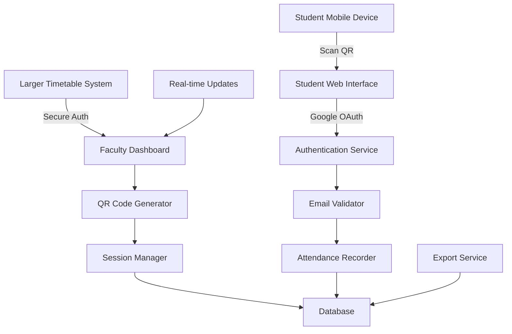
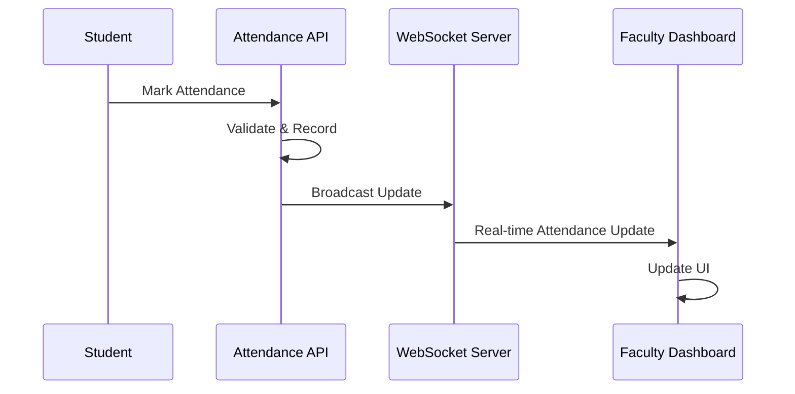

# Design Document

## Overview

The QR-based attendance system is a web application that enables secure, time-limited attendance marking through rotating QR codes. The system consists of two main interfaces: a faculty dashboard for managing attendance sessions and a student interface for marking attendance via Google OAuth authentication.

## Architecture

The system follows a client-server architecture with the following components:



### Technology Stack
- **Backend**: Node.js with Express.js
- **Database**: SQLite for development (easily replaceable with PostgreSQL/MySQL)
- **Authentication**: Google OAuth 2.0
- **Real-time Communication**: WebSockets (Socket.io)
- **QR Code Generation**: qrcode library
- **Frontend**: HTML5, CSS3, JavaScript (vanilla or lightweight framework)

## Components and Interfaces

### 1. Faculty Dashboard Component

**Purpose**: Provides faculty interface for managing attendance sessions

**Key Features**:
- Session initiation and termination
- Real-time QR code display with 30-second rotation
- Live attendance monitoring
- Export functionality

**Interface**:
```javascript
class FacultyDashboard {
  startSession(courseInfo)
  endSession(sessionId)
  displayQRCode(qrData)
  updateAttendanceList(attendanceData)
  exportAttendanceData(sessionId, format)
}
```

### 2. QR Code Generator Component

**Purpose**: Generates time-limited, secure QR codes

**Key Features**:
- Cryptographically secure token generation
- 30-second rotation cycle
- URL encoding with session and token data

**Interface**:
```javascript
class QRCodeGenerator {
  generateQRCode(sessionId, timestamp)
  rotateQRCode(sessionId)
  validateToken(token, sessionId)
  invalidateExpiredTokens()
}
```

### 3. Student Authentication Component

**Purpose**: Handles student login and email validation

**Key Features**:
- Google OAuth integration
- Email pattern validation
- Database lookup for student verification

**Interface**:
```javascript
class StudentAuth {
  authenticateWithGoogle(authCode)
  validateEmailPattern(email)
  checkStudentExists(email)
  recordAttendance(email, sessionId, metadata)
}
```

### 4. Session Manager Component

**Purpose**: Manages attendance session lifecycle

**Key Features**:
- Session creation and termination
- Token management and validation
- Real-time attendance tracking

**Interface**:
```javascript
class SessionManager {
  createSession(facultyId, courseInfo)
  endSession(sessionId)
  isSessionActive(sessionId)
  getSessionAttendance(sessionId)
  validateSessionToken(sessionId, token)
}
```

## Data Models

### Session Model
```javascript
{
  id: "uuid",
  facultyId: "string",
  courseInfo: {
    courseName: "string",
    courseCode: "string",
    section: "string"
  },
  startTime: "timestamp",
  endTime: "timestamp",
  isActive: "boolean",
  currentToken: "string",
  tokenExpiry: "timestamp"
}
```

### Student Model (Hardcoded for now)
```javascript
{
  email: "string",
  name: "string",
  rollNumber: "string",
  branch: "string",
  year: "string"
}
```

### Attendance Record Model
```javascript
{
  id: "uuid",
  sessionId: "uuid",
  studentEmail: "string",
  timestamp: "timestamp",
  ipAddress: "string",
  userAgent: "string"
}
```

## Error Handling

### Client-Side Error Handling
- Network connectivity issues
- QR code scanning failures
- Authentication failures
- Session expiry notifications

### Server-Side Error Handling
- Database connection failures
- OAuth service unavailability
- Invalid token/session validation
- Rate limiting violations

**Error Response Format**:
```javascript
{
  success: false,
  error: {
    code: "ERROR_CODE",
    message: "Human readable message",
    details: "Additional technical details"
  }
}
```

## Security Considerations

### Authentication Security
- Faculty authentication delegated to larger timetable system
- Google OAuth for student authentication
- CSRF tokens for all state-changing operations
- Secure session management

### QR Code Security
- Cryptographically secure random token generation
- 30-second token expiry
- Session-bound tokens
- IP address logging for audit trails

### Rate Limiting
- Per-IP rate limiting for attendance marking
- Per-session rate limiting to prevent abuse
- Exponential backoff for repeated failures

## Testing Strategy

### Unit Testing
- QR code generation and validation
- Email pattern validation
- Session management logic
- Authentication flow components

### Integration Testing
- Google OAuth integration
- Database operations
- WebSocket real-time updates
- End-to-end attendance flow

### Security Testing
- Token expiry validation
- Rate limiting effectiveness
- CSRF protection
- SQL injection prevention

### Performance Testing
- Concurrent user handling
- QR code rotation performance
- Database query optimization
- WebSocket connection limits

## Real-time Features

### WebSocket Implementation
- Real-time attendance updates to faculty dashboard
- QR code rotation notifications
- Session status updates
- Connection management and reconnection logic

### Update Flow


## Export and Integration

### Export Format (JSON)
```javascript
{
  sessionInfo: {
    id: "uuid",
    courseInfo: {...},
    startTime: "timestamp",
    endTime: "timestamp"
  },
  attendance: {
    present: [
      {
        email: "student@heritageit.edu.in",
        name: "Student Name",
        timestamp: "timestamp"
      }
    ],
    absent: [
      {
        email: "absent@heritageit.edu.in",
        name: "Absent Student"
      }
    ]
  },
  summary: {
    totalStudents: 30,
    presentCount: 25,
    absentCount: 5,
    attendancePercentage: 83.33
  }
}
```

### Integration Points
- Secure authentication handoff from larger timetable system
- Export API for attendance data retrieval
- Webhook support for real-time integration
- Standard REST API for programmatic access